# gh-triage

A GitHub notification triage tool for developers who struggle with the all-or-nothing nature of GitHub's notifications. Too easy to accidentally mark something as read? It's gone. `gh-triage` remembers every item *until you actively archive it*.

`gh-triage` polls GitHub for activity you care about, maintains local state in SQLite, fires desktop notifications via `notify-send`, shows a Waybar-compatible badge, and presents a `ratatui` TUI for browsing and actioning items.

<p align="center">
  
</p>

## Install

```bash
cargo install --path .
```

A sample config is included in the repo — copy it and fill in your details:

```bash
mkdir -p ~/.config/gh-triage
cp config.example.toml ~/.config/gh-triage/config.toml
$EDITOR ~/.config/gh-triage/config.toml
```

## Config

See `config.example.toml` for a commented starting point. The key fields:

```toml
github_user = "your-username"

[watch]
repos = [
    "your-org/*",              # entire org — wildcard
    "someone/specific-repo",   # individual repo
]
```

The GitHub token is resolved automatically from (in order): `github_token` in config, `GH_TOKEN` env var, or `gh auth token`.

### Watch rules

`watch.repos` entries support two forms:

- **`org/*`** — watch all repos in an org (uses `org:` GitHub search qualifier)
- **`owner/repo`** — watch a specific repo (uses `repo:` qualifier)

For all watched repos, items where you are a requested reviewer, assignee, author, or mentioned are tracked.

### Per-repo overrides

| Section | Behaviour |
|---------|-----------|
| `[watch.all]` | Fetch everything (all issues/PRs) regardless of involvement |
| `[watch.ignore]` | Skip entirely, even if it matches a watch rule |

## Usage

| Command | Description |
|---------|-------------|
| `gh-triage` | Launch TUI (default) |
| `gh-triage daemon` | Run polling daemon |
| `gh-triage waybar` | Print Waybar JSON and exit |
| `gh-triage poll` | Run one poll cycle and exit |
| `gh-triage list` | Print active items to stdout |
| `gh-triage archive <id>` | Archive an item by ID |
| `gh-triage setup systemd` | Install systemd user service |
| `gh-triage setup waybar` | Print Waybar config snippet |

## TUI keybindings

| Key | Action |
|-----|--------|
| `j` / `↓` | Move down |
| `k` / `↑` | Move up |
| `g` / `G` | Go to first / last item |
| `Enter` | Open in browser |
| `a` | Archive item (re-appears if new activity occurs) |
| `A` | Toggle archived view |
| `Tab` | Toggle latest / by-repo view |
| `R` | Refresh |
| `?` | Keybindings popup |
| `q` | Quit |

Items show a `●` indicator when unseen in the current session. Colour coding: yellow = review requested, cyan = assigned, green = authored, white = mentioned.

Archiving an item hides it from the active list. If new comments are added to an archived item, it automatically returns to the active list.

## AI summaries

When new items are found, `gh-triage` shells out to the `claude` CLI to generate a 1-2 sentence summary. When an item gets new comments, the summary is regenerated with a focus on what's new. If `claude` is not in PATH, summaries are silently skipped.

## Setup helpers

### Systemd service

Install the daemon as a systemd user service:

```bash
gh-triage setup systemd
```

This writes `~/.config/systemd/user/gh-triage.service` and prints the enable command. It won't overwrite an existing file.

### Waybar

Print the Waybar config snippet:

```bash
gh-triage setup waybar
gh-triage setup waybar --terminal foot   # override terminal (default: alacritty)
```

Paste the output into your Waybar config and reload.

### Shell greeting

To see a quick summary of active items each time you open a terminal, add this to your `~/.bashrc` (or `~/.zshrc`):

```bash
gh-triage list 2>/dev/null
```

Or for a one-line count:

```bash
gh-triage waybar 2>/dev/null | jq -r '.tooltip // empty'
```

Either line will silently do nothing if the database doesn't exist yet or the config isn't set up.

## Data locations

| Path | Purpose |
|------|---------|
| `~/.config/gh-triage/config.toml` | Configuration |
| `~/.local/share/gh-triage/db.sqlite` | Local state |
| `~/.config/systemd/user/gh-triage.service` | Daemon service (optional) |
